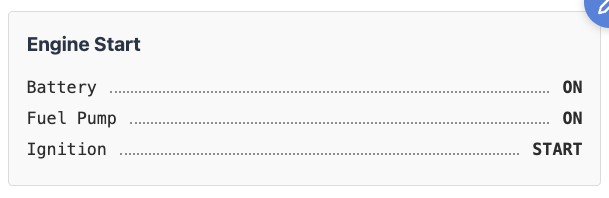
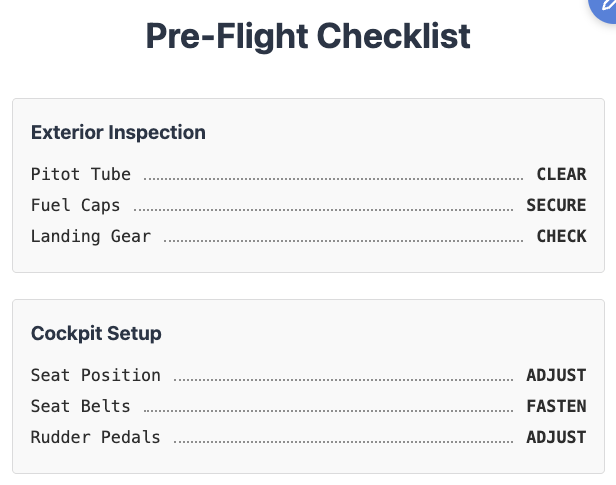
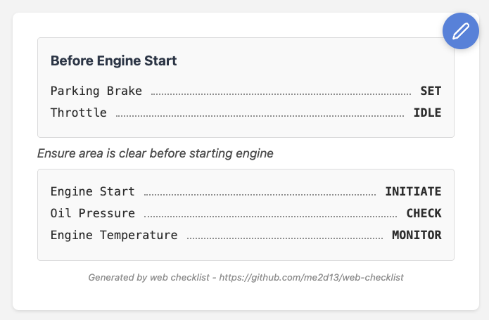
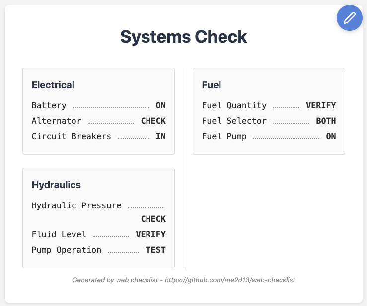
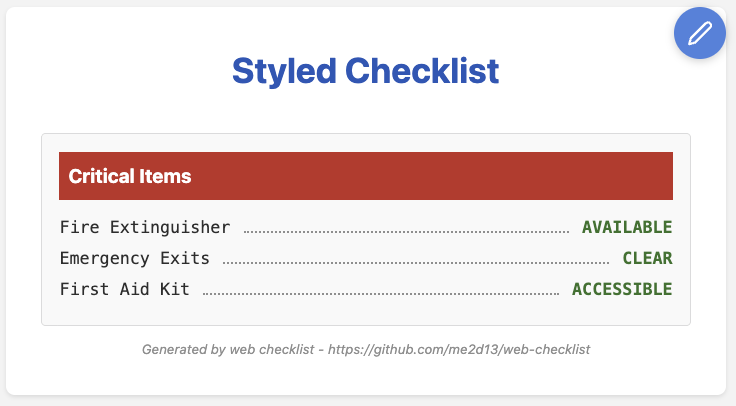
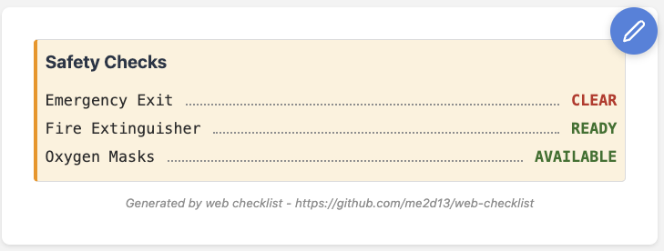
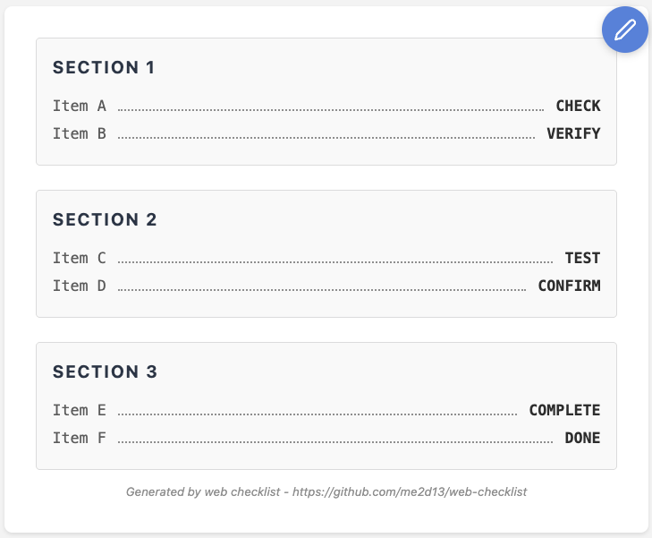
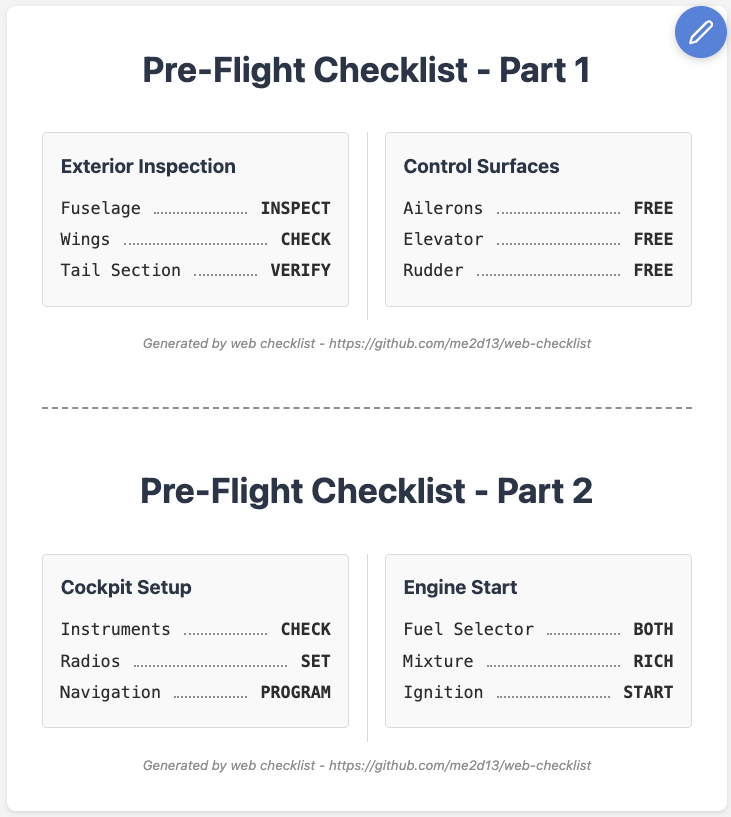
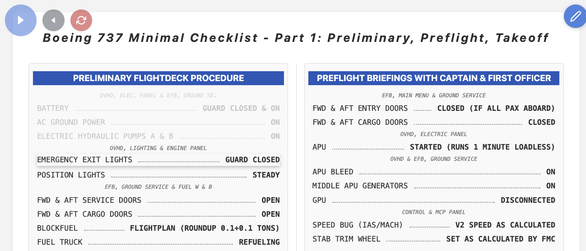
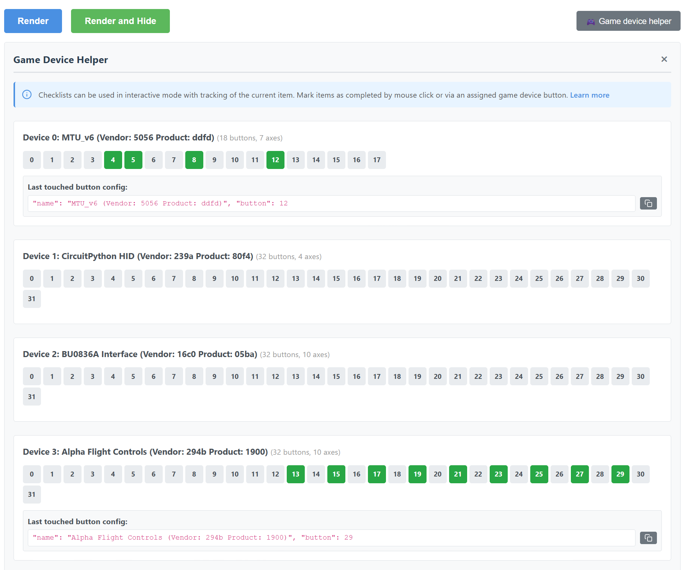

# Web Checklist Tutorial

This tutorial will guide you through creating checklists from simple to advanced, covering all features step by step.

## Table of Contents

1. [Your First Checklist](#1-your-first-checklist)
2. [Adding Multiple Sections](#2-adding-multiple-sections)
3. [Using Text Elements](#3-using-text-elements)
4. [Multi-Column Layout](#4-multi-column-layout)
5. [Basic Styling](#5-basic-styling)
6. [Named Styles](#6-named-styles)
7. [Default Styles](#7-default-styles)
8. [Page Breaks and Multi-Page Checklists](#8-page-breaks-and-multi-page-checklists)
9. [Interactive Mode](#9-interactive-mode)
10. [Gamepad Integration](#10-gamepad-integration)
11. [Loading from URL](#11-loading-from-url)
12. [Advanced Examples](#12-advanced-examples)

---

## 1. Your First Checklist

**Goal:** Create a simple checklist with one section and a few steps.

### JSON Structure

```json
{
    "elements": [
        {
            "type": "sequence",
            "title": "Engine Start",
            "steps": [
                {
                    "item": "Battery",
                    "state": "ON"
                },
                {
                    "item": "Fuel Pump",
                    "state": "ON"
                },
                {
                    "item": "Ignition",
                    "state": "START"
                }
            ]
        }
    ]
}
```

### What You'll See



**[→ Try this example live](https://me2d13.github.io/web-checklist/?url=https://raw.githubusercontent.com/me2d13/web-checklist/master/src/examples/tutorial/01-first-checklist.json)**

### Key Points

- `elements` array contains all checklist items
- `type: "sequence"` creates a checklist section
- `title` is optional but recommended
- Each step has `item` (left side) and `state` (right side)
- Dotted line automatically fills the space between item and state

---

## 2. Adding Multiple Sections

**Goal:** Create a checklist with multiple sections.

### JSON Structure

```json
{
    "title": "Pre-Flight Checklist",
    "elements": [
        {
            "type": "sequence",
            "title": "Exterior Inspection",
            "steps": [
                {
                    "item": "Pitot Tube",
                    "state": "CLEAR"
                },
                {
                    "item": "Fuel Caps",
                    "state": "SECURE"
                }
            ]
        },
        {
            "type": "sequence",
            "title": "Cockpit Setup",
            "steps": [
                {
                    "item": "Seat Position",
                    "state": "ADJUST"
                },
                {
                    "item": "Seat Belts",
                    "state": "FASTEN"
                }
            ]
        }
    ]
}
```

### What You'll See



**[→ Try this example live](https://me2d13.github.io/web-checklist/?url=https://raw.githubusercontent.com/me2d13/web-checklist/master/src/examples/tutorial/02-multiple-sections.json)**

### Key Points

- Top-level `title` appears as the main heading
- Multiple sequences create separate sections
- Sections appear in the order defined in the array

---

## 3. Using Text Elements

**Goal:** Add notes and instructions between checklist sections.

### JSON Structure

```json
{
    "elements": [
        {
            "type": "sequence",
            "title": "Before Engine Start",
            "steps": [
                {
                    "item": "Parking Brake",
                    "state": "SET"
                }
            ]
        },
        {
            "type": "text",
            "text": "Ensure area is clear before starting engine"
        },
        {
            "type": "sequence",
            "steps": [
                {
                    "item": "Engine Start",
                    "state": "INITIATE"
                }
            ]
        }
    ]
}
```

### What You'll See



**[→ Try this example live](https://me2d13.github.io/web-checklist/?url=https://raw.githubusercontent.com/me2d13/web-checklist/master/src/examples/tutorial/03-text-elements.json)**

### Key Points

- `type: "text"` creates a text-only element
- Useful for notes, warnings, or instructions
- Sequences without titles flow naturally after text elements
- Text elements can also be used within sequences as text steps

---

## 4. Multi-Column Layout

**Goal:** Display checklist in multiple columns for better space utilization.

### JSON Structure

```json
{
    "title": "Systems Check",
    "columns": 2,
    "elements": [
        {
            "type": "sequence",
            "title": "Electrical",
            "steps": [...]
        },
        {
            "type": "sequence",
            "title": "Hydraulics",
            "steps": [...]
        },
        {
            "type": "sequence",
            "title": "Fuel",
            "steps": [...]
        }
    ]
}
```

### What You'll See



**[→ Try this example live](https://me2d13.github.io/web-checklist/?url=https://raw.githubusercontent.com/me2d13/web-checklist/master/src/examples/tutorial/04-multi-column.json)**

### Key Points

- `columns` field sets the number of columns (1-3 typical)
- Content automatically balances across columns
- Elements won't break across columns (break-inside: avoid)
- Works great for landscape printing

---

## 5. Basic Styling

**Goal:** Customize colors, fonts, and appearance.

### JSON Structure

```json
{
    "title": "Styled Checklist",
    "titleStyle": {
        "color": "#1565c0",
        "fontSize": "2rem",
        "textAlign": "center"
    },
    "elements": [
        {
            "type": "sequence",
            "title": "Critical Items",
            "titleStyle": {
                "backgroundColor": "#d32f2f",
                "color": "white",
                "padding": "0.5rem"
            },
            "steps": [
                {
                    "item": "Fire Extinguisher",
                    "state": "AVAILABLE",
                    "stateStyle": {
                        "color": "#2e7d32",
                        "fontWeight": "bold"
                    }
                }
            ]
        }
    ]
}
```

### What You'll See



**[→ Try this example live](https://me2d13.github.io/web-checklist/?url=https://raw.githubusercontent.com/me2d13/web-checklist/master/src/examples/tutorial/05-basic-styling.json)**

### Key Points

- **Styles are CSS properties:** All style fields accept standard CSS properties that are applied directly to HTML elements
- Property names use **camelCase** (e.g., `backgroundColor`, `fontSize`) instead of kebab-case
- `titleStyle` - styles the title
- `itemStyle` - styles the item (left side)
- `stateStyle` - styles the state (right side)
- `style` - styles the container element

**Available CSS Properties:**

You can use any valid CSS property. Common examples include:
- Colors: `color`, `backgroundColor`
- Typography: `fontSize`, `fontWeight`, `fontStyle`, `letterSpacing`, `textAlign`
- Spacing: `padding`, `margin`
- Borders: `border`, `borderLeft`, `borderRadius`
- Layout: `display`, `width`, `height`

For a complete list of CSS properties, see [MDN CSS Reference](https://developer.mozilla.org/en-US/docs/Web/CSS/Reference).

---

## 6. Named Styles

**Goal:** Define reusable styles to avoid repetition.

Suppose you want to style half of the elements with different color and text style. You would need to copy same style to all these elements. Instead of that you can define this style, give it a name and in the element just use this name instead of complete definition.

### JSON Structure

```json
{
    "namedStyles": {
        "warning": {
            "backgroundColor": "#fff3e0",
            "borderLeft": "4px solid #ff9800",
            "padding": "0.5rem"
        },
        "critical": {
            "color": "#d32f2f",
            "fontWeight": "bold"
        }
    },
    "elements": [
        {
            "type": "sequence",
            "title": "Safety Checks",
            "style": "warning",
            "steps": [
                {
                    "item": "Emergency Exit",
                    "state": "CLEAR",
                    "stateStyle": "critical"
                }
            ]
        }
    ]
}
```

### What You'll See



**[→ Try this example live](https://me2d13.github.io/web-checklist/?url=https://raw.githubusercontent.com/me2d13/web-checklist/master/src/examples/tutorial/06-named-styles.json)**

### Key Points

- Define styles once in `namedStyles`
- Reference by name (string) instead of object
- Reduces duplication and maintains consistency
- Can mix named styles and inline styles

---

## 7. Default Styles

**Goal:** Apply styles to all elements of a specific type.

Suppose you want to change all section titles by giving them custom look. With named styles you can create the style once and mention the style for every title. However if you want really to modify all titles, you can set style as default and then it would be applied to all elements. You don't need to mark the elements anyhow, default style will be applied... by default.

### JSON Structure

```json
{
    "defaultStyle": {
        "sequence": {
            "titleStyle": {
                "letterSpacing": "0.1em",
                "textTransform": "uppercase"
            },
            "itemStyle": {
                "color": "#666"
            }
        }
    },
    "elements": [
        {
            "type": "sequence",
            "title": "Section 1",
            "steps": [...]
        },
        {
            "type": "sequence",
            "title": "Section 2",
            "steps": [...]
        }
    ]
}
```

### What You'll See



**[→ Try this example live](https://me2d13.github.io/web-checklist/?url=https://raw.githubusercontent.com/me2d13/web-checklist/master/src/examples/tutorial/07-default-styles.json)**

### Key Points

- `defaultStyle` applies to all elements of that type
- Priority: default < sequence-level < element-level
- Reduces repetition for consistent styling
- Can be overridden by specific element styles

---

## 8. Page Breaks and Multi-Page Checklists

**Goal:** Create multi-page checklists with page breaks.

### JSON Structure

```json
{
    "title": [
        "Pre-Flight Checklist - Part 1",
        "Pre-Flight Checklist - Part 2"
    ],
    "columns": 2,
    "elements": [
        {
            "type": "sequence",
            "title": "Exterior Inspection",
            "steps": [...]
        },
        {
            "type": "page-break"
        },
        {
            "type": "sequence",
            "title": "Cockpit Setup",
            "steps": [...]
        }
    ]
}
```

### What You'll See



**[→ Try this example live](https://me2d13.github.io/web-checklist/?url=https://raw.githubusercontent.com/me2d13/web-checklist/master/src/examples/tutorial/08-page-breaks.json)**

### Key Points

- `type: "page-break"` creates a new page
- Title can be an array (one per page)
- Visual separator in web view
- Forces page break when printing
- Each page gets its own footer

---

## 9. Interactive Mode

**Goal:** Use the checklist interactively with click-to-complete.

### How to Use

1. Select "Interactive" mode in the mode selector
2. Click "Render" or "Render and Hide"
3. Click any item to mark it as complete
4. Use Next/Previous buttons to navigate
5. Click Reset to start over

### What You'll See



### Key Features

- **Click to complete:** Click any item to mark it and all previous items as complete
- **Current item highlight:** 3D raised effect with subtle pulse animation
- **Completed items:** Shown at 25% opacity
- **Navigation buttons:** Next, Previous, Reset
- **Auto-scroll:** Current item stays visible
- **Smart navigation:** Skips text-only elements

---

## 10. Gamepad Integration

**Goal:** Control checklist navigation with hardware buttons.

### Finding Your Device

1. Click "🎮 Game device helper" button
2. Press any button on your gamepad
3. Device name and button number will appear
4. Click the copy button to copy the JSON config

### Adding to Your Checklist

```json
{
    "title": "Flight Checklist",
    "controls": {
        "next": {
            "name": "BU0836A Interface (Vendor: 16c0 Product: 05ba)",
            "button": 21
        },
        "previous": {
            "name": "BU0836A Interface (Vendor: 16c0 Product: 05ba)",
            "button": 20
        },
        "reset": {
            "name": "BU0836A Interface (Vendor: 16c0 Product: 05ba)",
            "button": 2
        }
    },
    "elements": [...]
}
```

### What You'll See




**[→ Try this example live](https://me2d13.github.io/web-checklist/?url=https://raw.githubusercontent.com/me2d13/web-checklist/master/src/examples/tutorial/10-gamepad.json)**

### Key Points

- Only works in Interactive mode
- Device name must match exactly
- Button indices start at 0
- Can map different devices to different actions
- Real-time button state display

---

## 11. Loading from URL

**Goal:** Load checklists from external sources.

### URL Parameters

**Load local example:**
```
https://me2d13.github.io/web-checklist/?example=minimal
```

**Load from external URL:**
```
https://me2d13.github.io/web-checklist/?url=https://example.com/checklist.json
```

### Use Cases

- Share checklists with others
- Store checklists in cloud storage
- Version control your checklists
- Quick access to frequently used checklists

---

## 12. Advanced Examples

### Boeing 737 Checklist

See the [737 example](https://me2d13.github.io/web-checklist/?example=737) for a real-world complex checklist featuring:

- Multiple pages with page breaks
- Extensive use of named styles
- Default styles for consistency
- Text steps within sequences
- Gamepad button mapping
- Multi-column layout

### Best Practices

1. **Start simple:** Begin with basic structure, add styling later
2. **Use named styles:** Define common styles once
3. **Set defaults:** Use `defaultStyle` for consistency
4. **Test both modes:** Verify in Interactive and Print modes
5. **Consider printing:** Test print preview for landscape layout
6. **Use text elements:** Add notes and instructions where needed
7. **Organize with page breaks:** Split long checklists into logical sections

---

## Next Steps

- Read the [JSON Format Reference](REFERENCE.md) for complete JSON specification
- Explore the example files in `src/examples/`
- Create your own checklists!

## Need Help?

- Check the [JSON Format Reference](REFERENCE.md) for detailed field descriptions
- Look at example files for inspiration
- Open an issue on GitHub for bugs or questions
